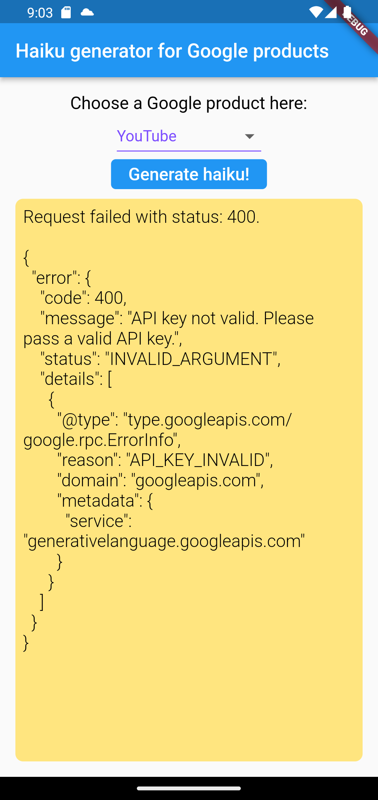

# setup

Replace YOUR_API_KEY with your API key.  
https://github.com/LeoAndo/flutter_use_palm_demo/blob/main/lib/data/repositories/poem_repository_impl.dart#L11

# development Memo
https://github.com/LeoAndo/flutter_use_palm_demo/issues/1 

# capture
now state: Requesting access to PaLM API 
